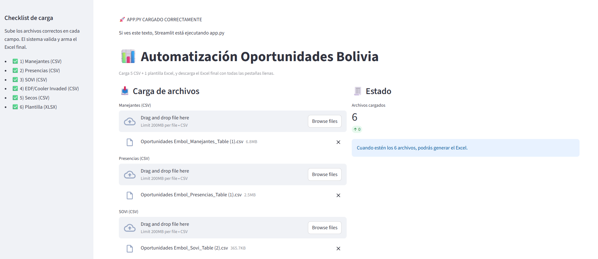

# 📊 Automatización Oportunidades Bolivia
Likn APP: https://bolivia-oportunidades-automation-embol-cbcasffdclshtpdmxkfvj7.streamlit.app/

Automatización completa para la generación del **reporte semanal de Oportunidades Embol Bolivia**, construida en **Python + Streamlit**.

La aplicación permite cargar **5 archivos CSV + 1 plantilla Excel** y genera automáticamente un **Excel final con más de 40 pestañas**, respetando el diseño original, filtros por ciudad, grupo de canal y transformaciones específicas de negocio.

---

## 🚀 Automatización (Interfaz)



> Interfaz en Streamlit donde el usuario carga los archivos y descarga el Excel final listo para uso ejecutivo.

---

## 🧠 ¿Qué problema resuelve?

Antes:
- Procesos manuales en Excel
- Alto riesgo de errores
- Mucho tiempo replicando filtros por ciudad y canal
- Transformaciones complejas (EDF, SOVI, VAP, SECOS) hechas a mano

Ahora:
- ✅ Cero trabajo manual
- ✅ Validación automática de archivos
- ✅ Transformaciones consistentes
- ✅ Reporte listo en segundos

---

## 📥 Archivos de entrada

La aplicación requiere **exactamente 6 archivos**, cargados desde la interfaz:

1. **Manejantes (CSV)**  
   Información demográfica y de gestión del punto.

2. **Presencias (CSV)**  
   Base principal de oportunidades.

3. **SOVI (CSV)**  
   Share of Visible Inventory.

4. **EDF / Cooler Invaded (CSV)**  
   Información de invasión de equipos de enfriamiento.

5. **Secos (CSV)**  
   Información de marcas y universo de secos.

6. **Plantilla Excel (XLSX)**  
   Archivo base con el diseño y las 40 pestañas predefinidas.

---

## 🧩 ¿Qué genera la app?

Un **Excel final** con:

- REQ.1 – Demografía
- REQ.2 – Oportunidades base
- Pestañas por **Grupo Canal**:
  - Tradicional (TT)
  - Comer & Beber (C&B)
- Pestañas por **Ciudad**:
  - SC, CBBA, LP, EA, OR, PO, SU, TJ
- Secciones especiales:
  - **VAP** (Kiosko)
  - **SOVI**
  - **EDF** (Invasion + Tipo Invasion)
  - **SECOS**

---

## 🔄 Transformaciones clave

### 🧊 EDF (Equipos de Enfriamiento)

Las columnas:
- `invasion_5_or_less`
- `invasion_6_12`
- `invasion_12_24`
- `invasion_more_than_24`

Se consolidan en:

- **Invasion** → `5 o menos`, `Entre 6 y 12`, `Mas de 24`, etc.

Y las columnas:
- `alcoholic_beverages`
- `competitor_products`
- `other_products`

Se consolidan en:

- **Tipo Invasion** → `Productos de la competencia`, `Bebidas Alcoholicas`, etc.

---

## 🏗 Arquitectura del proyecto

```text
.
├── app.py                  # Interfaz Streamlit
├── requirements.txt
├── README.md
│
├── pipeline/
│   ├── __init__.py
│   ├── config.py            # Configuración (ciudades, hojas, anchors)
│   ├── transforms.py        # Limpieza, filtros y transformaciones
│   ├── excel_writer.py      # Escritura en plantilla Excel
│   └── runner.py            # Orquestador principal
│
└── assets/
    └── app_screenshot.png   # Imagen para README
